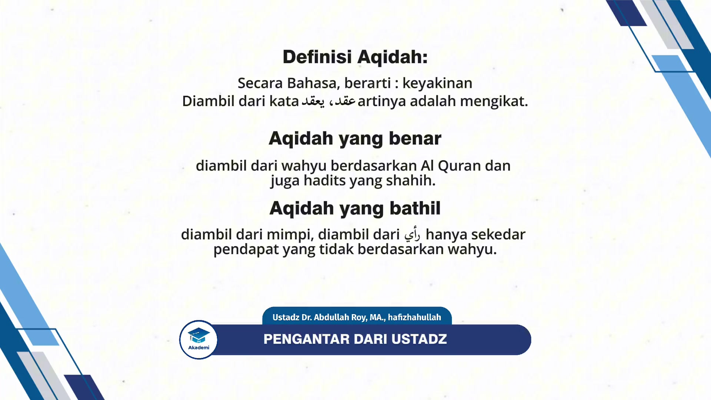
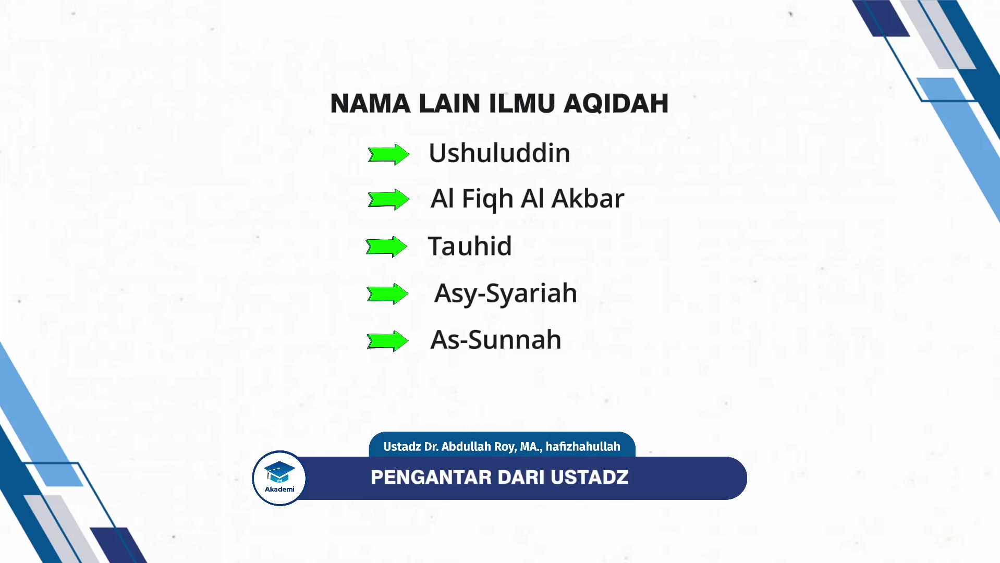
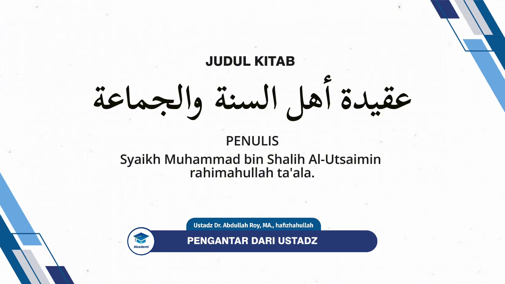
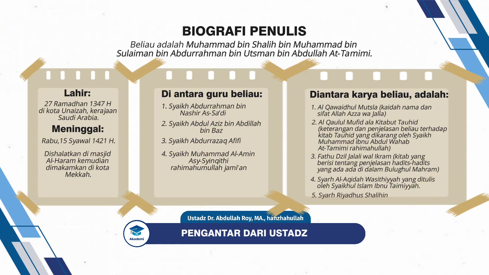

# AQ1-01: Pengantar dari Ustadz

<video controls>
  <source src="https://akademi.ap-south-1.linodeobjects.com/prodi1/semester1/AQ1/dkjska-AQ1-01-01.mp4" type="video/mp4">
</video>

<audio controls style="width: 100%; display: inline-block;">
  <source src="https://stx.abdullahroy.com/academy/AQ1/AQ1-01/vG7X-AQ1-01-03.mp3" type="audio/mpeg">
</audio>

## Materi Pendukung

- [Slides](https://stx.abdullahroy.com/academy/AQ1/AQ1-01/N5gu-AQ1-01-04.pdf){:target="_blank"}
- [Text](https://stx.abdullahroy.com/academy/AQ1/AQ1-01/vtqQ-AQ1-01-02.txt
){:target="_blank"}

> Halaqah ke-1 ini berisikan tentang definisi dan keutamaan Aqidah, pokok Aqidah Ahlu Sunnah wal Jama’ah, biografi singkat penulis, resensi kitab serta taqdim dari Syaikh bin Baz.

بِسْمِ ٱللَّهِ ٱلرَّحْمَـٰنِ ٱلرَّحِيمِ

اَلسَّلاَمُ عَلَيْكُمْ وَرَحْمَةُ اللّهِ وَبَرَكَاتُه

الحمد لله والصلاة والسلام على  رسول الله وعلى آله وصحبه و من وَالَاه

Para santri HSI Akademi di mana pun antum berada, وفقكم الله جميعًا.

الحمد لله kita bersyukur kepada الله سبحانه و تعالى yang telah memberikan نعمة dan masih terus memberikan نعمة kepada kita semuanya, baik yang ظاهر maupun yang باطن. Dan tentunya nikmat yang paling besar yang الله سبحانه و تعالى berikan kepada kita adalah نعمة Islam. Islam yang merupakan agama satu-satunya yang diridhai oleh الله سبحانه و تعالى. Yang الله سبحانه و تعالى tidak menerima agama apapun selain agama ini.

الله سبحانه و تعالى mengatakan:

إِنَّ الدِّينَ عِندَ اللَّهِ الْإِسْلَامُ

"Sesungguhnya agama yang benar di sisi الله adalah Al-Islam..." ([QS. Ali Imran:19](https://quran.ksu.edu.sa/index.php?l=id#aya=3_19&m=hafs&qaree=husary&trans=id_indonesian){:target="_blank"}).

Dan الله سبحانه و تعالى mengatakan:

وَمَن يَبْتَغِ غَيْرَ الْإِسْلَامِ دِينًا فَلَن يُقْبَلَ مِنْهُ وَهُوَ فِي الْآخِرَةِ مِنَ الْخَاسِرِينَ

"Dan barangsiapa yang mencari agama selain agama Islam maka tidak akan diterima darinya, dan dia di akhirat termasuk orang-orang yang merugi." ([QS. Ali Imran:85](https://quran.ksu.edu.sa/index.php?l=id#aya=3_38&m=hafs&qaree=husary&trans=id_indonesian){:target="_blank"}).

Maka di antara bentuk syukur kita di atas نعمة hidayah kepada Islam ini adalah bersungguh-sungguh di dalam mempelajari agama Islam dan juga bersungguh-sungguh di dalam mengamalkan apa yang ada di dalamnya berupa syari'at, menjalankan perintah Allah dan juga Rasul-Nya, meninggalkan larangan Allah dan juga Rasul-Nya.

Kemudian, إن شاء الله kita pada kesempatan kali ini dan pada edisi-edisi selanjutnya akan membahas tentang masalah aqidah.

## Definisi Aqidah

Dan aqidah kalau diterjemahkan ke dalam bahasa kita adalah "keyakinan". Diambil dari kata عقد ، يعقد yang artinya adalah mengikat. Dan arti dari aqidah adalah segala sesuatu yang kita gunakan untuk mengikat hati kita.

Dan aqidah terbagi menjadi dua, ada aqidah yang benar dan di sana ada aqidah yang tidak benar.

Tentunya aqidah yang benar yang shahihah adalah aqidah yang diambil dari wahyu berdasarkan القرآن dan juga hadits yang shahih. Dan di sana ada aqidah yang bathilah. Yang tidak diambil dari wahyu, diambil dari mimpi, diambil dari رأي yang hanya sekedar pendapat yang tidak berdasarkan wahyu. Maka ini adalah aqidah-aqidah yang bathilah.

إن شاء الله kita akan mempelajari aqidah yang benar, aqidah yang shahihah yang berdasarkan القرآن dan juga حديث dengan pemahaman para salaf, para sahabat رضي الله تعالى عنهم.

## Nama-nama Ilmu Aqidah

Dan ilmu aqidah ini memiliki beberapa nama dipakai  oleh para ulama. Terkadang mereka menggunakan istilah ushuluddin, pokok-pokok agama karena di dalam aqidah ini mengandung perkara-perkara yang merupakan pondasi, merupakan pokok yang harus diyakini oleh seorang muslim.

Ada di antara mereka yang menamakan ilmu aqidah ini dengan Al-Fiqh Al-Akbar, Al-Fiqh artinya pemahaman, Al-Akbar artinya adalah yang paling besar. Dinamakan demikian karena ilmu aqidah ini adalah perkara yang harus dipahami oleh seorang muslim dan juga muslimah, sehingga dinamakan Al-Fiqh Al-Akbar. Sebagaimana Al-Imam Abu Hanifah رحمه الله menamakan kitab beliau Al-Fiqh Al-Akbar, dan di situ beliau menyebutkan tentang aqidah para salaf.

Dan terkadang dinamakan ilmu tauhid karena tauhid ini adalah pondasinya pondasi, dia  adalah pokok dari Aqidah Ahlus Sunnah Wal Jama'ah.
Dan juga nama-nama yang lain, dinamakan Asy-Syariah sebagaimana Al-Imam Al-Ajurri mengarang kitab tentang masalah aqidah dan menamakannya dengan Asy-Syariah.
Dan ada yang menamakan As-Sunnah seperti Ibnu Abi Ashyim Al-Khalal dan juga yang lainnya, mereka menamakan kitab mereka yang berisi tentang masalah aqidah dengan As-Sunnah.

## Hukum dan keutamaan mempelajari Aqidah

Mempelajari aqidah ini adalah perkara yang sangat penting dan hukum mempelajarinya adalah wajib.
Dan akan kita sebutkan sebagian saja, yang berkaitan dengan keutamaan mempelajari aqidah. Di antaranya:

1. Bahwasanya aqidah ini apabila dipelajari dengan benar berdasarkan Al Qur'an dan Hadits dengan pemahaman yang benar, yaitu pemahaman para salaf, maka ini bisa menjadi pendorong bagi seseorang untuk melakukan ketaatan kepada الله, apabila aqidahnya adalah aqidah yang kuat, keimanannya adalah keimanan yang benar, keimanan yang kuat, maka ini akan berpengaruh terhadap ketaatan dia kepada الله سبحانه و تعالى, dia akan semakin semangat dan ikhlas di dalam menjalankan perintah الله dan juga Rasul-Nya dan dia akan menjadi orang yang sangat takut kepada الله untuk berbuat maksiat, sekecil apapun kemaksiatan, baik dilihat oleh manusia maupun tidak dilihat oleh manusia.

    Ini bisa muncul apabila seseorang tertanam di dalam hatinya aqidah yang benar, makanya orang yang belajar aqidah dengan baik, diharapkan ini akan terlihat pada ketaatan dia kepada الله سبحانه و تعالى .

2. Demikian pula di antara pentingnya mempelajari aqidah bahwasanya orang yang memiliki aqidah yang benar dijanjikan oleh الله سبحانه و تعالى dengan keamanan di akhirat dan juga dijanjikan dengan hidayah.

    الله سبحانه و تعالى  mengatakan:

    
الَّذِينَ آمَنُوا وَلَمْ يَلْبِسُوا إِيمَانَهُمْ بِظُلْمٍ أُولَٰئِكَ لَهُمُ الْأَمْنُ وَهُمْ مُهْتَدُونَ

    "Orang-orang yang beriman dan dia tidak mencampuri keimanannya dengan kezhaliman maka merekalah orang-orang yang mendapatkan keamanan dan merekalah orang-orang mendapatkan petunjuk." ([QS Al-An'am:82](https://quran.ksu.edu.sa/index.php?l=id#aya=6_82&m=hafs&qaree=husary&trans=id_indonesian){:target="_blank"}).

    Orang-orang yang beriman, beriman dengan الله, beriman kepada Rasul, beriman kepada malaikat, beriman kepada hari akhir, beriman kepada taqdir. Artinya ini adalah pokok dari Aqidah Islamiyah itu sendiri, aqidah ahlussunnah di situ sumbernya. Dan dia tidak mencampuri keimanannya dengan kezhaliman. Tidak mencampuri imannya kepada الله dengan kesyirikan. Tidak mencampuri keimanan tersebut dengan pendustaan atau keraguan. Maka merekalah orang-orang yang mendapatkan keamanan. Di saat manusia di hari kiamat dalam keadaan mereka takut, maka الله سبحانه و تعالى akan memberikan kepada orang orang yang memiliki aqidah yang shahihah, aqidah yang benar, yang ia tidak mencampuri aqidah tersebut dengan kotoran, maka الله سبحانه و تعالى akan memberikan kepada mereka ketenangan, keamanan pada hari tersebut.

    
وَهُمْ مُهْتَدُونَ
    

    "Dan merekalah orang-orang yang mendapatkan  petunjuk."

    Di dunia ini dia termasuk orang yang diberikan petunjuk oleh الله سبحانه و تعالى, dikeluarkan dari tempat yang gelap, kegelapan kesyirikan, kegelapan kebid'ah-an, kegelapan kemaksiatan, kegelapan kejahilan (suatu musibah seseorang berada di tempat yang gelap). Apabila seseorang berada di tempat yang gelap maka itu adalah musibah. Tidak tahu apa yang harus dilakukan. Tidak tahu mana yang benar mana yang salah.

    Tapi ketika ada cahaya dikeluarkan oleh الله dari tempat yang gelap tersebut ke tempat yang terang benderang di situ jelas baginya mana yang benar, mana yang tidak benar. Maka ini adalah sebuah kenikmatan yang besar dan ini hanya di dapatkan bagi orang-orang yang memiliki aqidah yang shahih. Dan barangsiapa diantara kita yang ingin mendapatkan hidayah maka belajarlah aqidah. Mempelajari aqidah adalah perkara yang sangat penting dan hukum mempelajarinya adalah wajib. Dan akan kita sebutkan sebagian saja yang berkaitan dengan keutamaan mempelajari aqidah.

3. Kemudian, di antara yang menunjukkan tentang pentingnya mempelajari aqidah ini bahwasanya ibadah seseorang tidak akan sah kecuali apabila dia bertauhid pada الله (mengesakan الله di dalam ibadah) dan tauhid ini adalah Ashlul Ushul, dan dia adalah pokoknya, pokok inti dari Aqidah Islamiyyah ada pada tauhid.

    الله سبحانه و تعالى mengatakan:

    

    وَمَآ أُمِرُوٓاْ إِلَّا لِيَعۡبُدُواْ ٱللَّهَ مُخۡلِصِينَ لَهُ ٱلدِّينَ حُنَفَآءَ وَيُقِيمُواْ ٱلصَّلَوٰةَ وَيُؤۡتُواْ ٱلزَّكَوٰةَۚ وَذَٰلِكَ دِينُ ٱلۡقَيِّمَةِ
    

    "Tidaklah mereka diperintahkan kecuali supaya beribadah kepada الله dalam keadaan mengikhlaskan, mengesakan bagi الله سبحانه و تعالى, agama ini. Dalam keadaan حُنَفَآءَ yaitu dalam keadaan lurus hanya menghadap kepada الله berpaling dari kesyirikan dan mereka mendirikan shalat, membayar zakat yang demikian adalah agama yang lurus."
    ([QS. Al-Bayyinah:5](https://quran.ksu.edu.sa/index.php?l=id#aya=98_5&m=hafs&qaree=husary&trans=id_indonesian){:target="_blank"}).

    Dan masih banyak lagi keutamaan-keutamaan  yang lain. Secara ringkas saya sebutkan di sini di antaranya.

4. Bahwasanya orang yang memiliki aqidah yang shahihah maka ini adalah modal utama untuk masuk ke dalam surga.

    Nabi صلى الله عليه وسلم mengatakan:

    

مَنْ مَاتَ وَهُوَ يَعْلَمُ أَنَّهُ لاَ إِلٰهَ إِلاَّ الله دَخَلَ الْجَنَّةَ
    

    "Barangsiapa yang meninggal dunia dan dia mengetahui (menyadari) dan mengamalkan bahwasanya tidak ada sesembahan yang berhak disembah kecuali Allah, maka dia akan masuk ke dalam Surga." (Hadits shahih riwayat Muslim).

5.  Orang yang memiliki aqidah yang benar maka dia akan mendapatkan syafaat dari Nabi صلى الله عليه وسلم.
    Inilah orang yang berhak untuk mendapatkan syafaat Nabi صلى الله عليه وسلم di hari kiamat. Sebagaimana di dalam sebuah hadits yang diriwayatkan dari Abu Hurairah.

    Rasulullah صلى الله عليه وسلم ditanya, "Wahai Rasulullah, siapakah orang yang bergembira dengan syafaatmu di hari kiamat?"

    Maka Nabi صلى الله عليه وسلم mengatakan,

    

    لَقَدْ ظَنَنْتُ يَا أَبَا هُرَيْرَةَ أَنْ لاَ يَسْأَلَنِي عَنْ هَذَا الْحَدِيثِ أَحَدٌ أَوَّلُ مِنْكَ، لِمَا رَأَيْتُ مِنْ حِرْصِكَ عَلَى الْحَدِيثِ، أَسْعَدُ النَّاسِ بِشَفَاعَتِي يَوْمَ الْقِيَامَةِ مَنْ قَالَ لاَ إِلَهَ إِلاَّ اللَّهُ. خَالِصًا مِنْ
    قِبَلِ نَفْسِهِ
    

    "Saya sudah menyangka wahai Abu Hurairah tidak akan ada orang yang bertanya kepadaku tentang hadits ini, orang yang lebih terdahulu daripada dirimu. Karena aku melihat engkau semangat untuk mengetahui hadits Nabi صلى الله عليه وسلم."

    Kemudian beliau صلى الله عليه وسلم mengatakan:

    

    أَسْعَدُ النَّاسِ بِشَفَاعَتِي يَوْمَ الْقِيَامَةِ مَنْ قَالَ لاَ إِلَهَ إِلاَّ اللَّهُ. خَالِصًا مِنْ قِبَلِ نَفْسِهِ
    

    "Orang yang paling bahagia dengan syafaat pada hari kiamat adalah orang yang mengucapkan laa لاَ إِلَهَ إِلاَّ اللَّهُ (tiada Ilah yang berhak disembah dengan benar kecuali Allah) secara ikhlas dari dalam hatinya." (Hadits shahih riwayat Imam Al-Bukhari nomor 6570).

    Jelas ini menunjukkan kepada kita, di antara keutamaan mempelajari aqidah adalah cara kita untuk bisa mendapatkan syafaat Rasulullah صلى الله عليه وسلم.

## Judul Kitab

Supaya kita bisa memahami aqidah ini dengan baik in sya Allah kita akan mempelajari, sebuah kitab yang berbicara tentang masalah aqidah Ahlus Sunnah wal Jama'ah  yang berjudul:

عقيدة أهل السنة والجماعة

<i>Aqidatu Ahli Sunnah Wal Jama'ah</i>

Kitab ini dikarang oleh seorang ulama yang in sya Allah tidak asing lagi, beliau adalah Syaikh Muhammad bin Shalih Al-Utsaimin rahimahullah ta'ala.

## Biografi Penulis Kitab

Sebelum kita masuk pada pembahasan kitab, إن شاء الله kita akan bersama membaca kitab ini, kemudian memberikan penjelasan secara ringkas.
Kami ingin mengenalkan terlebih dahulu pada pendengar sekalian tentang siapa pengarang kitab ini. Supaya kita mengetahui tentang kedudukan beliau dan mengetahui tentang keutamaan atau kedudukan kitab ini. Kalau kita mengetahui bagaimana pengarangnya dan keutamaannya dan kelebiahannya kita tahu tentang apa yang beliau karang ini.

Baik, kami akan sebutkan secara ringkas biografi dari pengarang: beliau adalah Muhammad bin Shalih bin Muhammad bin Sulaiman bin Abdurrahman bin Utsman bin Abdullah At-Tamimi. Dikenal dengan Muhammad bin Shalih Al-Utsaimin. Kalimat Al-Utsaimin diambil dari nama kakek beliau yang ke-4 yang bernama Utsman.
Beliau رحمه الله lahir pada tanggal 27 (malam tanggal 27) Ramadhan pada tahun 1347 Hijriyah di kota Unaizah di kerajaan Saudi Arabia.

Beliau رحمه الله sejak kecil sudah berkeinginan untuk mempelajari ilmu, sehingga dari kecil beliau sudah belajar menulis, belajar adab dan mendaftar ke sebagian sekolah. Di dalam biografi beliau disebutkan, bahwasanya beliau sudah menghafal Al-Qur'an sejak kecil, demikian pula menghafal kitab-kitab mutun yang ringkas baik masalah hadits maupun masalah fiqih.
Beliau mempelajari ilmu dari sebagian ulama, di antaranya adalah Syaikh Abdurrahman bin Nashir As-Sa'di رحمه الله. Dan saat itu Syaikh As-Sa'di melihat pada diri Muhammad bin Shalih Al-Utsaimin ada kecerdasan dan cepatnya beliau di dalam memahami apa yang disampaikan. Kemudian beliau mendaftar ke sebagian sekolah di antaranya di Mahad 'Ilmi yang ada di Riyadh dan lulus dari sana.

Di antara guru beliau yang dikenal, adalah:

1. **Syaikh Abdurrahman bin Nashir As-Sa'di**.
Syaikh As-Sa'di termasuk guru beliau yang pertama. Beliau mengambil ilmu dan faidah dari Syaikh As-Sa'di, terutama di dalam masalah manhaj, masalah mengikuti dalil, beliau juga sangat mengikuti gurunya di dalam (bagaimana) cara mengajar kepada murid-muridnya.
2. **Syaikh Abdul Aziz bin Abdillah bin Baz** (mufti kerajaan Saudi Arabia sebelum yang sekarang). Beliau belajar dari Syaikh bin Baz dan membaca shahih Al-Bukhari  dan beberapa karangan dari Syaikhul Islam Ibnu Taimiyyah dan beliau banyak mengambil faidah dari Syaikh bin Baz dalam ilmu hadits dan masalah fiqih.
3. **Syaikh Abdurrazaq Afifi رحمه الله**. Beliau membaca kepada Syaikh Abdurrazaq beberapa kitab dan belajar masalah Nahwu, Al-Balaghah.
4. **Syaikh Muhammad Al-Amin Asy-Syinqithi رحمه الله** dan beberapa ulama yang lain.

Syaikh Muhammad bin Shalih Al-Utsaimin rahimahullah termasuk ulama yang mengajar di Masjid Al-Haram, di Masjid Nabawi, khususnya di musim-musim haji di bulan Ramadhan dan pada saat liburan musim panas.
Beliau memiliki banyak kegiatan yang bersifat ilmiyyah. Beliau menyampaikan ceramah di dalam negara Saudi Arabia maupun di luar Saudi Arabia dan banyak jabatan-jabatan yang beliau terima.
Allah Subhanahu wa Ta'ala telah memberikan banyak kelebihan kepada beliau rahimahullah, dilihat dari ceramah-ceramah beliau dan juga pertemuan-pertemuan beliau dengan kaum muslimin. Beliau bisa mendatangkan ayat dan hadits dengan cepat dan beliau dikenal sebagai orang yang kuat di dalam mengambil faidah, mengambil sebuah hukum dari sebuah ayat ataupun hadits.

Beliau rahimahullah telah menghabiskan waktunya (umurnya) untuk mengajar dan memberikan fatwa, menulis dan membahas sesuatu. Hampir-hampir beliau tidak memberikan waktu untuk dirinya beristirahat.
Ketika beliau berjalan menuju masjid atau berjalan pulang menuju rumahnya dari masjid, beliau gunakan waktu tersebut untuk kegiatan ilmiyyah. Beliau gunakan waktunya untuk menjawab pertanyaan-pertanyaan dari jama'ah atau murid-muridnya.

Bagi orang yang sering mendengar ceramah-ceramah dan kajian-kajian beliau, mereka akan melihat bagaimana Syaikh Muhammad bin Shalih Al-Utsaimin memiliki metode yang sangat bagus di dalam mengajar. Beliau banyak bertanya kepada muridnya kemudian juga bermunaqasyah dengan muridnya. Ada yang mengatakan hal tersebut beliau lakukan untuk menanamkan rasa percaya diri kepada murid-muridnya. Ketika beliau bertanya kepada muridnya dan muridnya bisa menjawab dengan benar dan mereka terbiasa menjawab, diharapkan dengan cara seperti ini murid-murid tersebut akan memiliki rasa percaya diri.
Beliau rahimahullah sangat perhatian kepada murid-muridnya dan memberikan pengarahan kepada mereka dan bersabar di dalam memberikan pengajaran kepada mereķa. Beliau mendengar pertanyaan-pertanyaan dari mereka dan memperhatikan urusan-urusan mereka.

Di antara peninggalan beliau dari sisi ilmiyyah adalah banyaknya karangan-karangan beliau yang sudah dicetak. kaum muslimin, para penuntut ilmu agama dan para ulama yang sudah mengambil faidah dari karangan-karangan beliau.
Di antara karangan-karangan beliau, adalah:

1. Al Qawaidhul Mutsla (kaidah nama dan sifat Allah Azza wa Jalla).
2. Al Qaulul Mufid ala Kitabut Tauhid (keterangan dan penjelasan beliau terhadap kitab Tauhid yang dikarang oleh Syaikh Muhammad ibnu Abdul Wahab At-Tamimi rahimahullah).
3. Fathu Dzil Jalali wal Ikram (kitab yang berisi tentang penjelasan hadits-hadits yang ada di dalam Bulughul Mahram).
4. Syarh Al-Aqidah Wasithiyyah yang dikarang oleh Syaikhul Islam Ibnu Taimiyyah.
5. Syarh Riyadhus Shalihin.

Dan masih banyak lagi karangan-karangan beliau rahimahullah.

## Resensi Kitab

Setelah kita mengetahui secara singkat tentang biografi pengarang, maka poin yang selanjutnya adalah mengetahui tentang secara global kitab beliau yang akan kita pelajari.

Kitab beliau ini berjudul عقيدة أهل السنة والجماعة - yang artinya adalah Aqidah Ahlus Sunnah Wal Jama'ah yaitu aqidah yang dimiliki oleh Ahlus Sunnah Wal Jama'ah. Isi dari kitab ini adalah  penjelasan tentang  rukun iman yang enam.
Sebagaimana kita tahu bahwasanya aqidah Ahlus Sunnah wa Jama'ah ini, bersumber pada rukun iman yang enam. Ini adalah dinamakan oleh para ulama dengan Ushulul Iman (pokok dari keimanan). Pokok dari keimanan adalah rukun iman yang enam.

Ucapan Syaikhul Islam Ibnu Taimiyah di dalam kitab beliau العقيدة الواسطيّة-Al Aqidah Al Wasithiyah beliau Rahimahullah mengatakan di awal kitab,
اعتقاد الفرقة النّاجية المنصورة إلى قيام السّاعة أهل السنّة والجماعة
Beliau mengatakan, "Aqidah golongan yang selamat, yang ditolong sampai hari kiamat, Ahlus Sunnah wal Jama'ah”.
Kemudian setelah itu beliau mengatakan,

الإيمان بالله، وملا ئكته، وكتبه، ورسله، والبعث بعد الموت، والإمان بالقدر خيره وشره

Setelah mengatakan aqidah Ahlus Sunnah wal Jama'ah sampai hari kiamat adalah beriman kepada Allah, malaikat-malaikat-Nya, kitab-kitab-Nya, rasul-rasul-Nya, kebangkitan setelah kematian dan beriman dengan takdir yang baik maupun yang buruk.
Berarti beliau menyebutkan di sini rukun iman yang enam.

Kemudian  setelahnya beliau mengatakan,

من الإيمان بالله

Termasuk beriman kepada Allah, dan seterusnya.
Dan ini menunjukan seperti yang sudah kita sampaikan tadi, bahwasanya aqidah Ahlus Sunnah itu pokoknya ada pada rukun iman yang enam ini. Makanya Syaikh Muhammad bin Shalih Al-Utsaimin Rahimahullah, beliau menjelaskan di dalam kitab ini tentang rukun iman yang enam dan menamakan kitabnya dengan عقيدة أهل السنة والجماعة. Karena pokok Aqidah Ahlus Sunnah wal Jama'ah ada di dalam rukun iman yang enam ini.

Saya sebutkan secara ringkas tentang apa isi dari kitab ini. Beliau akan menyebutkan tentunya pertama kali adalah tentang beriman kepada Allah, termasuk di dalamnya beriman dengan Rububiyah Allah, dengan Uluhiyah Allah dan beriman dengan nama dan sifat Allah Subhanahu wa Ta'ala.

Beliau akan sampaikan bagaimana cara beriman dengan Rububiyah Allah, Uluhiyah Allah dan juga dengan nama dan sifat-Nya, sesuai dengan Al-Quran dan hadits dengan pemahaman para salaf, para sahabat Radhiyallahu ta’ala ‘anhum.
Dan bagian dari rukun iman yang pertama ini akan beliau sampaikan secara agak luas, karena memang ini adalah pokok di antara rukun iman yang enam.

Kemudian beliau akan berbicara tentang beriman dengan para malaikat Allah Subhanahu wa Ta'ala sebagai rukun iman yang kedua. Akan beliau bicarakan tentang cara beriman kepada malaikat termasuk di antaranya adalah beriman dengan tugas-tugas dan amalan-amalan yang Allah Subhanahu wa Ta'ala  tugaskan kepada para malaikat.

Kemudian juga beliau berbicara tentang beriman dengan kitab, beliau akan menyebutkan bahwasanya, Allah Subhanahu wa Ta'ala  menurunkan kepada  setiap rasul sebuah kitab. Kemudian beliau akan sebutkan tentang kitab-kitab yang diketahui dan dikabarkan kepada kita namanya.

Kemudian juga tentang keutamaan kitab yang terakhir yaitu Al-Qur'an dan keistimewaannya dibandingkan kitab-kitab sebelumnya.

Kemudian juga beriman dengan para Rasul akan beliau sebutkan tentang hikmah diutusnya para Rasul. Dan siapakah Rasul yang pertama, Rasul yang terakhir, siapakah Rasul yang paling afdhal, apa perbedaan antara Rasul dengan manusia yang lain.
Kemudian juga di dalam beriman kepada para Rasul ini, beliau akan menyebutkan tentang keyakinan Ahlus Sunnah tentang para sahabat Radhiyallahu Ta'ala ‘anhum dan kewajiban untuk menghormati mereka dan kewajiban menahan diri berbicara tentang fitnah yang terjadi di antara para sahabat.

Kemudian beliau akan berbicara tentang beriman dengan hari akhir, secara terperinci, termasuk di antaranya adalah beriman kepada hari kebangkitan, adanya pembagian kitab, kemudian beriman dengan timbangan amalan, syafaat yang khusus bagi Nabi Shallallahu 'alaihi wa Sallam dan juga syafaat yang umum yang dimiliki oleh Nabi dan juga yang lain.
Berbicara tentang telaga Nabi Shallallahu 'alaihi wa Sallam, berbicara tentang shirath yaitu jembatan yang akan dipasang di atas neraka dan akan berbicara tentang kewajiban beriman bahwa surga dan neraka sekarang sudah ada dan tidak akan punah.

Dan bagaimana keyakinan Ahlus Sunnah tentang orang-orang yang telah dikabarkan oleh Nabi Shallallahu 'alaihi wa Sallam masuk ke dalam surga atau masuk ke dalam neraka.

Beriman dengan fitnah kubur, adzab kubur, kenikmatan kubur, dan kewajiban untuk beriman dengan perkara-perkara yang ghaib yang dikabarkan kepada kita.

Kemudian juga, beliau akan berbicara tentang masalah takdir. Beriman dengan takdir yang merupakan rukun iman yang keenam, berbicara tentang beberapa tingkatan di dalam masalah takdir ini, dan bahwasanya seorang hamba memiliki kehendak,  memiliki qudrah, memiliki kemampuan dan tidak bolehnya seorang yang bermaksiat berdalih dengan takdir untuk membolehkan kemaksiatannya.

Kemudian yang terakhir, maka beliau akan menyebutkan tentang beberapa buah yang manis, akibat yang baik, pengaruh yang baik dari mempelajari aqidah ini. Mulai dari buah yang bisa kita petik dari beriman kepada Allah, beriman dengan malaikat, beriman kepada kitab, beriman dengan para Rasul, beriman dengan hari akhir dan beriman dengan takdir. Maka ini adalah kurang lebih secara global yang in sya Allah akan kita pelajari di dalam kitab ini.

Dan alhamdulillah kitab ini sudah diterjemahkan di dalam Bahasa Indonesia maka bisa [men-_download_-nya](https://drive.google.com/file/d/1q5h1Sm2_HcnrZLEjFtg8BxHH89o7r8iT/view){:target="_blank"} in sya Allah atau bisa mendapatkannya di toko-toko buku, Aqidah Ahlus Sunnah wal Jama’ah yang dikarang oleh Syaikh Muhammad bin Shalih Al-Utsaimin Rahimahullah.

## Taqdim Syaikh Bin Baz

Di antara yang menunjukkan tentang bagusnya kitab ini, dan pantasnya kitab ini untuk dipelajari adalah kitab ini telah diberikan taqdim oleh guru beliau sendiri yaitu Syaikh Bin Baz rahimahullah.
Syaikh Bin Baz rahimahullah menulis di awal kitab ini, bahwasanya beliau sudah membaca kitab ini dari awal sampai akhir, dan beliau rahimahullah memuji kitab ini. Oleh karena itu kita kami ingin membacakan taqdim atau ucapan yang ditulis oleh Syaikh Bin Baz rahimahullah di awal kitab ini, yang menunjukkan tentang bagaimana kedudukan kitab ini dan bagusnya kitab ini untuk dipelajari.

Syaikh Bin Baz rahimahullah, mengatakan:

بسم الله الرحمن الرحيم
 تقديم
الحمد الله وحده والصَّلاةُ والسَّلامُ على مَن لا نَبِيَّ بعدَهُ ، وعلى آلهِ وصحبِهِ

Setelah memulai dengan basmalah, kemudian beliau memuji Allah Subhanahu wa Ta'ala.
"Segala puji bagi Allah saja dan shalawat dan salam atas Nabi yang tidak ada Nabi setelahnya dan juga kepada keluarga dan para sahabatnya."

أما بعد: فقد اطّلعت على العقيدة القيّمة الموجزة، التي جمعها أخونا العلامة فضيلة الشيخ: محمد بن صالح العثيمين، وسمعتها كلها، فألفيتها مشتملة على بيان عقيدة أهل السنة والجماعة في باب: توحيد الله وأسمائه وصفاته

Adapun setelah itu, maka aku telah melihat aqidah yang lurus (ringkas) yang telah dikumpulkan oleh saudara kami العلامة

- Syaikh Bin Baz rahimahullah adalah guru dari Syaikh Muhammad bin Shalih Al-Utsaimin, beliau (Syaikh Bin Baz rahimahullah) begitu tawadhu-nya mengatakan أخونا (saudara kami).
- Ini menunjukkan tawadhunya para ulama.
Al'alamah (العلامة) gelar ini disampaikan oleh Syaikh Bin Baz kepada murid beliau (Syaikh Muhammad bin Shalih Al-Utsaimin)
- Ini menunjukkan keutamaan dan kedudukan Syaikh Muhammad bin Shalih Al-Utsaimin, di mata gurunya.

Syaikh Bin Baz rahimahullah adalah seorang 'alim, al-'Alamah (العلامة), beliau memberikan gelar kepada muridnya al-'Alamah (العلامة) menunjukkan tentang kedudukan Syaikh Muhammad bin Shalih Al-Utsaimin.

فضيلة الشيخ: محمد بن صالح العثيمين، وسمعتها كلها

Apa yang dikumpulkan oleh saudara kami (Syaikh Muhammad bin Shalih Al-Utsaimin) dan aku mendengar semuanya.
Syaikh Bin Baz rahimahullah tidak bisa melihat (buta) dan beliau mendengar apa yang dibacakan kepada beliau dari kitab ini.

فألفيتها مشتملة على بيان عقيدة أهل السنة والجماعة

Dan aku mendapatkan kitab ini mencakup penjelasan aqidah Ahlus Sunnah wal Jama’ah.

في باب: توحيد الله وأسمائه وصفاته

Di dalam masalah tauhid kepada Allah, nama-nama-Nya dan sifat-sifat-Nya.

وفي أبواب: الإِيمان بالملائكة والكتب والرسل واليوم الآخر، وبالقدَر خيره وشره.

Dan juga aqidah Ahlus Sunnah wal Jama'ah di dalam keimanan mereka kepada malaikat, keimanan kepada kitab, keimanan kepada para rasul, keimanan kepada hari akhir dan juga keimanan dengan takdir yang baik maupun yang buruk.

Ini adalah isi dari kitab ini. Menunjukkan bahwasanya beliau (Syaikh Bin Baz rahimahullah) mendengar ketika kitab ini dibacakan kepada beliau dari awal sampai akhir.

Kemudian beliau (Syaikh Bin Baz rahimahullah) menyatakan:

وقد أجاد في جمعها وأفاد

Dan sungguh beliau sudah bagus di dalam mengumpulkan permasalahan-permasalahan yang ada di dalam kitab ini dan juga sudah memberikan faidah. Kitab ini bagus dan berfaidah.

وذكر فيها ما يحتاجه طالب العلم وكل مسلم في إيمانه بالله وملائكته وكتبه ورسله واليوم الآخر وبالقدر خيره وشره

Dan beliau menyebutkan di dalam kitab ini apa yang dibutuhkan oleh seorang penuntut ilmu dan setiap muslim di dalam keimanan dia kepada Allah, malaikat, kitab-kitab-Nya, para rasul-Nya dan juga hari akhir dan keimanan dia kepada takdir yang baik maupun yang buruk.
Syaikh Bin Baz rahimahullah mengatakan:

وقد ضمَّ إلى ذلك فوائد جمة تتعلّق بالعقيدة قد لا توجد في كثير من الكتب المؤلفة في العقائد.

Bahwasanya Syaikh Muhammad bin Shalih Al-Utsaimin telah menambah di dalam kitab ini beberapa faidah yang sangat bagus yang berkaitan dengan masalah aqidah.
Di akhir kitab beliau menyebutkan buah beriman kepada ٱللَّٰه, buah beriman  kepada malaikat dan seterusnya. Di mana perkara-perkara ini (kata Syaikh Bin Baz) mungkin tidak ditemukan di dalam sebagian besar kitab-kitab yang dikarang tentang masalah aqidah.
Jarang kitab-ķitab aqidah yang menyebutkan tentang ثمرات  - buah dari beriman Allah, beriman kepada malaikat dan seterusnya.

Kemudian Syaikh Bin Baz rahimahullah mendoakan muridnya:

فجزاه الله خيرًا

"Semoga Allah membalas beliau dengan balasan yang lebih baik."

Ini adalah doa yang sangat agung yang diajarkan oleh Nabi shallallahu 'alayhi wa sallam.

وزاده من العلم والهدى، ونفع بكتابه هذا وبسائر مؤلفاته

”Semoga Allah Subhanahu wa Ta'ala, menambahkan kepada beliau ilmu dan juga petunjuk dan menjadikan seluruh kitab-kitab beliau bermanfaat.“

Karena Syaikh Muhammad bin Shalih Al-Utsaimin tidak hanya memiliki kitab ini saja tetapi beliau memiliki banyak kitab lain  sebagaimana yang pernah kita sebutkan contohnya.
Syaikh Bin Baz rahimahullah sebagai seorang guru beliau mendoakan kebaikan, "Semoga Allah Subhanahu wa Ta'ala menjadikan apa yang beliau tulis di dalam kitab ini dan kitab-kitab yang lain bermanfaat bagi kaum muslimin".

Kemudian Syaikh Bin Baz rahimahullah mengatakan:

وجعلنا وإيّاه وسائر إخواننا من الهداة المهتدين، الدّاعين إلى الله على بصيرة ؛ إنه سميع قريب

Dan semoga Allah Subhanahu wa Ta'ala menjadikan kita dan juga beliau dan seluruh saudara-saudara kami, semoga menjadi orang-orang yang memberikan petunjuk dan dia pun adalah orang yang mendapatkan petunjuk. Orang-orang yang mengajak kepada Allah di atas ilmu. Sesungguhnya Allah Subhanahu wa Ta'ala Dia-lah  yang Maha Mendengar lagi Maha Dekat.

قاله ممليه الفقير إلى الله ـ تعالى ـ عبدالعزيز بن عبدالله ابن باز سامحه الله

Telah mengatakan ini semua, orang yang faqir kepada Allah, Abdul Aziz ibnu Abdillah ibnu Baz samahahullah (Semoga Allah Subhanahu wa Ta'ala memaafkan dia).

وصلى الله وسلم على نبينا محمد، وآله وصحبه

Kemudian beliau menutup taqdim dan sambutan beliau terhadap kitab ini dengan membaca shalawat dan salam untuk Nabi Muhammad shallallahu 'alaihi wa salam, keluarganya dan para sahabatnya.

Itu adalah ucapan dan juga komentar dari guru dari Syaikh Muhammad bin Shalih Al-Utsaimin rahimahullah yaitu Syaikh Bin Baz rahimahullah. Menunjukkan bagaimana kedudukan kitab ini, dan dia adalah kitab aqidah yang ringkas. Dan perlu kita ketahui bahwasanya kitab-kitab beliau Syaikh Muhammad bin Shalih Al-Utsaimin, di antara kelebihannya adalah di dalam kitabnya beliau menggunakan kata-kata dan kalimat-kalimat yang mudah dipahami bahkan oleh seorang penuntut ilmu yang baru (pemula) sekalipun in sya Allah bisa memahami apa yang beliau sampaikan. Ini di antara sebab kita memilih kitab ini.

Di samping itu, kitab ini adalah kitab yang ringkas, in sya Allah bisa kita selesaikan. Kata-kata yang digunakan adalah kata-kata yang in sya Allah mudah. Di samping itu kitab ini sudah diterjemahkan sehingga diharapkan nanti bisa mengikuti kajian ini secara beruntun.
Demikian yang bisa kami sampaikan, in sya Allah kita lanjutkan pada edisi-edisi selanjutnya, atau pada pertemuan-pertemuan selanjutnya.

Kita berdoa kepada Allah Subhanahu wa ta’ala, semoga Allah Subhanahu wa ta’ala menjadikan kita ikhlas di dalam menuntut ilmu agama ini dan semoga Allah Subhanahu wa ta’ala menjadikan apa yang kita pelajari ini menjadi ilmu yang bermanfaat bagi kita, bisa kita amalkan dalam kehidupan sehari-hari, tambahan hasanah (kebaikan) bagi kita di hari kiamat kelak.
Wallahu ta’ala a’lam. Wa billahi taufiq wal hidayah.

والسلام عليكم ورحمة اللّه وبركاته

